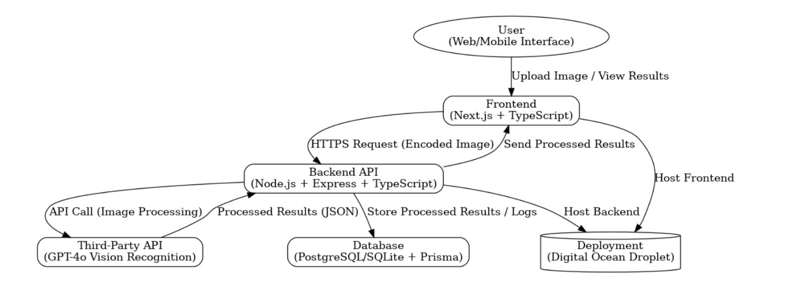
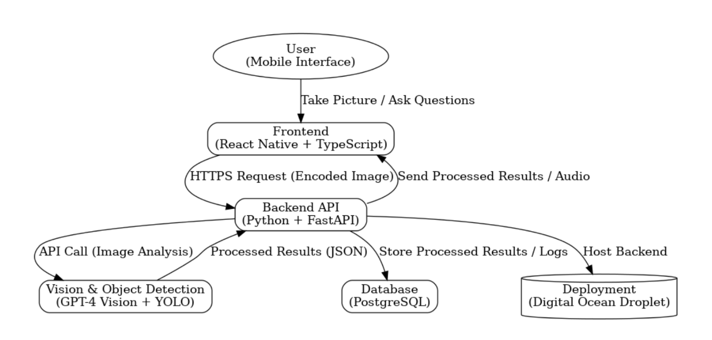
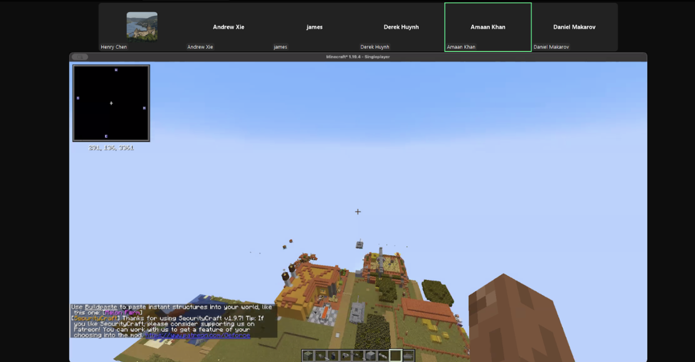

# Siloam

## Product Details
 
#### Q1: What is the product?

Our product is a web app designed to help visually impaired individuals gain real-time awareness of their surroundings through audio descriptions. It solves the challenge of navigating environments without visual cues by using a smartphone’s camera to detect objects and events and converting this information into natural, spoken descriptions. For instance, users can identify nearby objects such as vehicles, pedestrians, or obstacles, and ask questions like "What is in front of me?" or "Is there a bus stop nearby?" This app aims to enhance independence and safety, making it easier for users to confidently interact with their environment.

As a simple example, in this image, the user can point their smartphone camera left and right to ask if there is oncoming traffic or if it is safe to cross the street. This feature empowers users to navigate their surroundings confidently and make informed real-time decisions.
Another potential use case could be helping visually impaired users with shopping in a store. They can use it to read aisle signs or provide detailed audio descriptions of a specific item.

Furthermore, if time allows, we could incorporate a facial recognition system/database, to help visually impaired individuals spot known individuals from their surroundings. Maybe they are in a loud crowded environment and looking for a friend.

Finally, this is a self-proposed project and we do not have a partner.

#### Q2: Who are your target users?

Our target users are visually impaired individuals who rely on assistive technologies to navigate their daily environments independently. This includes working professionals commuting through busy urban areas, who need to know if traffic is approaching before crossing a street or if a bus stop is nearby. It also includes university students navigating crowded campuses, who may need to identify obstacles such as bicycles left in pathways, locate the entrance to a specific building, or determine if an elevator or staircase is ahead. These users value tools that not only provide real-time awareness of their surroundings but also allow them to ask specific questions, such as “Is there a clear path ahead?” or “Where is the nearest exit?” We understand that visual impairment is classified on a spectrum, and our product can be equally helpful for users on all ends of the spectrum. Our app empowers visually impaired individuals to safely and confidently interact with their environment by addressing these practical, everyday challenges.

#### Q3: Why would your users choose your product? What are they using today to solve their problem/need?

Visually impaired individuals currently rely on tools like white canes, guide dogs, or accessibility apps that provide basic functionality, such as detecting obstacles or reading text. While these tools are helpful, they are often limited to specific tasks and cannot provide detailed, real-time information about dynamic environments. This can lead to inefficiencies, safety concerns, and a lack of independence when navigating unfamiliar or complex surroundings. Instead of using multiple apps, we provide users with a one-stop shop to solve visual obstacles.

Our product addresses these gaps by offering visually impaired users real-time, natural language descriptions of their environment, enabling them to gain a deeper understanding of their surroundings. For instance, users can point their smartphone camera and receive audio feedback about nearby objects (“a yellow 40cm tall fire hydrant 5 feet away”), traffic conditions, or specific landmarks. Additionally, they can ask questions like, "Can I cross the street?" or "Where is the bus stop?" This level of interaction saves users time by delivering immediate, actionable information, reducing trial-and-error navigation, and helping them avoid potential hazards. 

Unlike existing solutions, our app doesn't just detect obstacles—it identifies and describes them in context (“sign that reads ‘sidewalk closed’, two meters tall”). This ability to provide precise, personalized, and dynamic feedback empowers users to make informed decisions in real time. Our product enhances safety and offers a greater sense of independence and confidence, making it a compelling choice for visually impaired individuals looking for a more comprehensive and interactive solution to navigate their environments.

#### Q4: What are the user stories that make up the Minumum Viable Product (MVP)?

**1. Object Identification**

As a visually impaired user, I want to identify objects in my immediate surroundings using my smartphone camera in order to navigate safely and avoid obstacles.

Acceptance Criteria:
The app detects objects within a 5-meter range of the smartphone camera.
The app provides clear, spoken descriptions of detected objects (e.g., "There is a car 3 meters ahead").
Users can specify whether they want brief or detailed descriptions of their surroundings.
If no objects are detected, the app says, "No objects nearby."

**2. Traffic Awareness**

As a visually impaired user, I want to point my smartphone camera at a street and ask if it is safe to cross in order to avoid oncoming traffic.

Acceptance Criteria:

The app recognizes moving vehicles and their proximity to the user.
The app clearly announces whether it is safe or unsafe to cross based on traffic patterns.
If it's safe, the app says, "It is safe to cross now." If unsafe, the app says, "Wait, there is traffic approaching."
The app updates traffic awareness every 2 seconds for real-time feedback.

**3. Location-Based Queries**

As a visually impaired user, I want to ask the app questions like "Is there a bus stop nearby?" in order to locate key landmarks and services around me.

Acceptance Criteria:

The app identifies and describes nearby landmarks or services (e.g., bus stops, restaurants, or stores) within a 100-meter radius.
Users can ask specific location-based queries, such as "Where is the nearest grocery store?"
The app responds with both distance and direction (e.g., "The bus stop is 20 meters to your left").
If no relevant landmarks are found, the app says, "No bus stops detected nearby."

**4. Customizable Audio Feedback**

As a visually impaired user, I want to adjust the speed and tone of audio descriptions in order to make the app more accessible to my preferences.

Acceptance Criteria:

The app includes settings to adjust speech rate (e.g., slow, normal, fast).
Users can toggle between male and female voice options.
Changes in audio settings take effect immediately.
The app retains customized audio preferences for future sessions.

**5. Real-Time Guidance**

As a visually impaired user, I want the app to guide me step-by-step as I navigate through a busy area in order to avoid obstacles and reach my destination safely.

Acceptance Criteria:

The app continuously monitors the camera feed and announces hazards such as "Step up ahead" or "Caution, obstacle on the right."
The app updates hazard descriptions every 2 seconds in real-time.
The app confirms when the area is clear of obstacles (e.g., "Path ahead is clear").
Users can pause or restart guidance at any time.

**6. Shopping Assistant:**

As a visually impaired user, I want the app to help me navigate grocery store aisles, and describe to me the product I am currently looking at so that I can make informed decisions while shopping.

Acceptance Criteria:
The app can read aisle signs and describe them clearly to me.
Users can point the app at a specific object, and get detailed information about the product (shape, colour, price, etc).
The app can read nutritional labels, and even help compare them against other products. 

Link to Mockup: https://www.figma.com/proto/tNsMMCYDSMgA0xa8K3RtkX/CSC301-D1-Figma?node-id=0-1&t=Kuo4mEe6BaJtd463-1

#### Q5: Have you decided on how you will build it? Share what you know now or tell us the options you are considering.

**Technology Stack**
* Back-end: JavaScript/TypeScript with Next.js or Express.js
* Front-end: Web-based using Next.js + TypeScript + React + TailwindCSS (mobile frontend support planned if time allows)
* Database: PostgreSQL/SQLite + Prisma (ORM)
* Image Recognition: GPT-4o for vision processing
* Deployment: Digital Ocean Droplet for hosting (backend & frontend)
  
**Architecture**

* The app follows a client-server model:
* Our app takes an image and uploads it via a web/mobile interface.
* Frontend (Next.js + TypeScript) sends an HTTPS request (encoded image) to the backend.
* Backend (Node.js + Express/Next.js API routes) processes the image/request into a proper request to external APIs
* Backend makes requests to GPT-4o, processes results and returns JSON responses.
* Frontend receives/interprets JSON responses and displays relevant information.
* Data may be logged in a PostgreSQL/SQLite database via Prisma (happens during the entire process).
* Deployment: Hosted on Digital Ocean, frontend (web) and backend routed via Nginx reverse proxy.

**Third-Party APIs & Tools**
* GPT-4o – For vision recognition.
* Digital Ocean – For cloud hosting.

**Secondary Goal (Mobile App):**

The technology stack includes:
* Frontend: React Native with TypeScript for building a cross-platform mobile app for iOS and Android.
    - React Native is a good choice because it has excellent support for mobile-specific features, like accessing the camera through libraries such as react-native-vision-camera. It also has a wide range of inbuilt and third-party libraries for handling images, push notifications, and other native functionality
* Backend: If possible, we will attempt to reuse the existing web-based backend to service mobile clients as well. Otherwise, Python with FastAPI for handling API requests and business logic.
* Database: PostgreSQL for storing processed results, logs, and user-related data.
Third-Party API:
* GPT-4 Vision and YOLO models for image analysis and object detection.
Deployment: 
* The application will be hosted on DigitalOcean Droplets, which will serve both the backend and support the mobile app.
  
The architecture consists of high-level components:
* Frontend: A React Native mobile app where users can capture images, ask questions about their surroundings, and receive audio responses.
* Backend: FastAPI handles HTTPS requests from the mobile app, processes data, and communicates with third-party APIs and object detection models.
* Vision and Object Detection: GPT-4 Vision and YOLO are used for analyzing images, detecting objects, and generating natural language descriptions.
* Database: PostgreSQL stores metadata, processed results, and logs for tracking and analysis.
* Deployment: DigitalOcean Droplets host the backend and integrate with the mobile app, ensuring scalability and reliability.

We will use third-party APIs like GPT-4 Vision for advanced image recognition and natural language descriptions, as well as YOLO for real-time object detection to provide safety-critical features. The application will be hosted on DigitalOcean for efficient deployment and management.

----
## Intellectual Property Confidentiality Agreement 
> Note this section is **not marked** but must be completed briefly if you have a partner. If you have any questions, please ask on Piazza.
>  
**By default, you own any work that you do as part of your coursework.** However, some partners may want you to keep the project confidential after the course is complete. As part of your first deliverable, you should discuss and agree upon an option with your partner. Examples include:
1. You can share the software and the code freely with anyone with or without a license, regardless of domain, for any use.
2. You can upload the code to GitHub or other similar publicly available domains.
3. You will only share the code under an open-source license with the partner but agree to not distribute it in any way to any other entity or individual. 
4. You will share the code under an open-source license and distribute it as you wish but only the partner can access the system deployed during the course.
5. You will only reference the work you did in your resume, interviews, etc. You agree to not share the code or software in any capacity with anyone unless your partner has agreed to it.

**Your partner cannot ask you to sign any legal agreements or documents pertaining to non-disclosure, confidentiality, IP ownership, etc.**

We are not working with a partner.

----

## Teamwork Details

#### Q6: Have you met with your team?

Fun facts:
* Henry: I like playing go, the board game. 
* Daniel: I love playing Minecraft.
* Andrew: I enjoy horror games.
* Derek: I have owned 11 pet fish.
* James: I love Volleyball.
* Amaan: I like chess.

Team activity: We played Minecraft together for a while as our team-building activity while also chatting and getting to learn more about each other. No villagers were harmed in the process.

#### Q7: What are the roles & responsibilities on the team?

Henry (Scrum Master & Fullstack Developer):
- Show the team how to use Next.js workflow. 
- Work on setting up the API endpoints for data exchange between frontend and backend.
- Assist with developing web based front end (including pages and react components). 
- Work on hosting solution, probably by setting up a digital ocean droplet and configuring NGINX reverse proxy. Ideally, set-up functioning SSL certification. 
- Responsible for weekly Scrum meetings, including recording meeting minutes.
- Chose this role due to experience working with the code stack (Next.js, React, TailwindCSS, Prisma ORM).
  
Derek (Backend Developer): 
- Develop API logic for parsing and dealing with received HTTP requests.
- Set up automatic calls to the APIs we are using to process image data.
- Packaging API responses for the front-end.
- Chose this role because I am interested in experimenting with image processing APIs.
- (Stretch) Figure out a potential on-device or serverless inference set up for our models in case we want to use smaller custom solutions.
  
Amaan (Full Stack Developer / Mobile developer):
- Develop a complementary mobile app using React Native. Adding features like photo uploads and camera integration. Ensuring seamless API integration with the backend.
- Working on the database set up to store and track incoming information. Setting up PostgreSQL with Prisma for storing user submissions and results. Tracking user activity and processing logs.
- Possibly help in ML Ops like managing the pipeline for integrating GPT-4o for vision recognition.
- Chose this role to learn more about the entire code stack.
  
Daniel (Partner Liaison & Backend Developer)
- Responsible for liaising/communicating with our supervisor (TA).
- Work on text-to-speech functionality processing.
- Also can focus on backend development ensuring seamless integration and system connectivity.
- Selected this role to build communication skills and deepen expertise in integrating text-to-speech and image processing technologies.

Andrew (Full Stack Developer)
- Develop a complementary mobile app (may become a stretch goal).
- Responsible for database schema and queries.
- Support development on a user-friendly single page web-based frontend.
- Support data exchanging between front and backend.
- Chose this role because I wanted some experience in full stack development as well as mobile development.

James (Backend Developer)
- API Development: Develop RESTful APIs to handle user queries, process camera input/ image data, and provide real-time responses.
- Performance Optimization: Ensure efficient processing and minimal latency for real-time audio feedback. Ensure algorithms are efficiently designed and are not using unnecessary resources
- Selected this role to get experience with proper Restful API development and because of interests with YOLO v8 models.

#### Q8: How will you work as a team?

The team will hold weekly online Scrum meetings during tutorial sessions before our TA slot to review progress, meet deadlines, and allocate resources, with minutes stored in the "deliverables/minutes" folder on GitHub. Ad hoc online meetings will be scheduled as needed to address issues or milestones, and Discord will serve as the primary communication tool for raising questions and organizing meetings. In-person coding sessions may occasionally be arranged to resolve complex issues, particularly when code dependencies require close collaboration.

Two meetings with the project partner/supervisor (TA) have been conducted before the D1 deadline. On January 16, the team discussed the project overview, UN goals, potential objectives, and a potential tech stack including NextJS, Supabase, and OpenAI. On January 21, the team finalized roles, assigned D1 tasks, and confirmed the potential codebase. A regular meeting schedule with the project partner will also be established for the remainder of the term.
  
#### Q9: How will you organize your team?

Our team communicates primarily through Discord, and our repository is hosted on GitHub, where we work in branches to keep the main branch clean and avoid conflicts. Tasks are tracked using Jira, with assignments based on task requirements and team member roles. During our weekly Scrum meetings, we review progress, assign new tasks, and reallocate work if someone is overloaded. These meetings essentially serve as sprint planning sessions, as they occur weekly and allow us to coordinate and prioritize tasks effectively. We will also use the deliverables as checkpoints to track overall progress, but our primary focus will be on the development and completion of core features. Individual tasks or bugs will be created as single tasks on Jira, while larger core features will be broken into multiple subtasks for better management.

Tasks will be prioritized based on three main factors:
1. Deliverable requirements
2. Dependencies
3. Key features

Task assignments will primarily be voluntary, with team members choosing tasks based on their roles, skills, and interests. This ensures that work is distributed according to expertise while giving everyone flexibility to take on work they are interested in. Progress will be monitored through Jira, with tasks moving through various statuses (e.g., To-Do, In Progress, and Completed) to give a clear picture of our progress from inception to completion.

#### Q10: What are the rules regarding how your team works?

We will be communicating on Discord at any time / frequently when issues come up, and to collaborate. We will also have weekly scheduled meetings that take place before we meet with our TA, to plan out the week ahead of us and make sure everyone stays on track during our sprint planning. We'll be keeping track of everyone's tasks on Jira, making sure everyone has a balanced workload and understands their tasks to complete for the week.

It's expected that at times some members may not be able to finish all their work due to external circumstances such as midterms or other conflicts, and it will be fine as long as they pick back up from where they left and resume contributing. However, if a member does not contribute for a week or longer, we'll have to discuss with them and let them know if there is any way we can support them and get them back on track. If the issue continues to be unresolved past this point then the TA will be contacted to help resolve the issue.

Q8 & Q9 responses from A1:

Henry: 
Q8: I found new team members through Piazza or other means (not friends)
Q9: I want to meet new people and build a project I'm happy to show others. 

Andrew:
Q8: I took the course to work with my friends
Q9: In this course I want to build on my current skillset and expand it to make me a more well-rounded engineer, in order to make me a more competitive candidate in the future once I graduate.

Daniel:
Q8: I wanted to take the course and found friends to team up with.
Q9: In this course, I want to gain experience working in a larger team environment, refine my project management skills, and deepen my knowledge in coding.

Amaan:
Q8: I took the course to work with my friends
Q9: In this course, I want to gain practical, hands-on experience and develop a deep understanding of foundational and advanced technologies, including JavaScript, React, cloud platforms, build tools, and database design. My goal is to not only enhance my technical expertise but also build the confidence to apply these skills in real-world projects, contributing meaningfully to development workflows. Additionally, I hope to use this opportunity to strengthen my problem-solving abilities, expand my knowledge of best practices, and lay a solid foundation for continuous growth in my career as a software developer

Derek:
Q8: I took the course to work with my friends
Q9: In this course, I want to gain practical, hands-on experience applying these concepts to real-world projects, gaining a deep understanding of software engineering and building a portfolio that demonstrates my ability to design, develop, and deliver effective software solutions while also understanding the user needs they address.

James:
Q8: I took this course to work with my friends
Q9: In this course, I aim to gain hands-on experience in software development, focusing on building efficient and user-friendly applications. I want to improve my skills in problem-solving, algorithm design, and deployment, while learning effective collaboration practices and agile workflows.

#### Q11. How does your team fit within the overall team organisation of the partner?
N/A - No partner.

#### Q12. How does your project fit within the overall product from the partner?
N/A No partner

## Potential Risks

#### Q13. What are some potential risks to your project?
**Uncertainty in GPT-4o Performance**
GPT-4o may struggle with object detection or accuracy, leading to unclear or unreliable descriptions. We want to provide detailed responses, so we will have to provide the correct prompts to receive the level of detail we desire. Concerns about processing time, which could impact application responsiveness. 

**Real-Time Performance Challenges**
Processing images in real time could result in delays, reducing usability for time-sensitive tasks. Many sources of latency are introduced in our pipeline, including: transferring image data from user device to our server, pre-processing image data in the server, sending request to external API, external API processing time, API response receiving and processing time, and finally transmitting and displaying the information to the user.

**Mobile Accessibility Issues**
Ensuring compatibility across devices and browsers may be difficult, limiting user adoption. Specifically, application accuracy and performance could be impacted by user device camera quality, or internet speeds. Devices may record images and videos in different formats and sizes, which would need to be unified for processing. 

**Misaligned User Expectations**
Users may expect advanced capabilities beyond what the app can currently deliver, leading to dissatisfaction. Our expectations of user accessibility, specifically on UI features could be misaligned (users might require larger buttons, or different ergonomic layouts). Users might desire different levels of detail, or be interested in specific features (ex: the exact colour of the object, or what material it is made out of, or the exact dimensions and shape). We would likely need to provide tailored details for the context, which could be challenging. 

**Limited User Testing**
Without sufficient feedback from visually impaired users, the app may not address real-world challenges effectively. None of the developers are seriously visually impaired, and do not have much experience working with and understanding user needs. This could lead to diverging expectations and goals, or misinformed design decisions. 

**Difficulty Setting Up the App**
Visually impaired users may find it difficult to set up the app independently without assistance.The initial setup process, such as granting permissions, connecting to the internet, or navigating menus, may not be intuitive or accessible. If the setup is not streamlined or doesn't provide sufficient audio or tactile guidance, it could deter users from adopting the app.

#### Q14. What are some potential mitigation strategies for the risks you identified?
**Uncertainty in GPT-4o Performance**
Test the model early, adjust scope, or explore alternative APIs; add fallback responses for errors. Adjust data provided by the user, or perform additional server side pre-processing. 

**Real-Time Performance Challenges**
Optimize workflows, compress & encoding images, and test on different network speeds to reduce latency. Prioritise key words and ideas when giving feedback. 

**Mobile Accessibility Issues**
Use responsive design and conduct cross-device testing (different camera quality and performance metrics); consider building a PWA for better performance. May require different optimisation or app presets based on detected hardware. 

**Misaligned User Expectations**
Clearly define capabilities via onboarding and FAQs; gather feedback to align with user needs. Trial the app ourselves blind-folded to see if the UI is ergonomic and easy to use. 
Limited User Testing
Recruit beta testers from relevant communities; iterate features based on real-world feedback.

**Complexity in Supporting Multiple Languages**
We can start by focusing on a few key languages commonly used by our target audience and gradually expand as needed. Using translation services like Google Translate can simplify localization, while keeping descriptions concise and easy to translate will ensure broader accessibility. Engaging native speakers for testing can also help validate the accuracy of translations.

**Difficulty Setting Up the App**
We can include a voice-guided setup process to help visually impaired users navigate easily, along with compatibility with screen readers like TalkBack and VoiceOver. Pre-configured settings can minimize the steps required during setup, and providing accessible tutorials or quick help options can further simplify the process.

